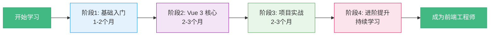

# 📚 Vue 3 完整学习教程

<div align="center">


**从零基础到 Vue 全栈开发的完整学习路径**

[快速开始](#-快速开始) • [学习路线](#-学习路线) • [项目结构](#-项目结构) • [配套教程](#-配套教程文档)

</div>

---

## 🎯 项目简介

这是一个**系统化的 Vue 3 学习项目**，包含：

### 📖 完整的学习文档（10 个章节）
- 从 HTML/CSS/JavaScript 基础到 Vue 3 全家桶
- 每个章节都有详细的代码示例和练习任务
- 循序渐进的学习路径，适合零基础学习者

### 💻 交互式实战项目（my-app/）
- 5 个章节的可运行示例代码
- 实时预览学习效果
- 边学边练，理论结合实践

### 🗺️ 可视化学习路线图
- Mermaid 流程图展示完整学习路径
- 可编辑的进度追踪表格
- 职业发展规划和里程碑

---

## ✨ 项目特色

| 特色 | 说明 |
|------|------|
| 🎓 **零基础友好** | 从 HTML/CSS/JS 基础开始，无需任何前端经验 |
| 📝 **系统化教程** | 10 个章节，覆盖前端开发完整知识体系 |
| 💡 **实战导向** | 每个章节都有练习任务和实战项目 |
| 🚀 **最新技术栈** | Vue 3 + Composition API + Vite + Pinia |
| 📊 **进度追踪** | 可编辑的学习进度表，随时掌握学习进度 |
| 🎯 **职业规划** | 从初级到高级的完整职业发展路径 |

---

## 🚀 快速开始

### 1. 克隆项目

```bash
git clone <repository-url>
cd vuedemo
```

### 2. 安装依赖

```bash
npm install
```

### 3. 启动开发服务器

```bash
cd my-app
npm run dev
```

访问 http://localhost:5173 查看交互式学习项目

### 4. 开始学习

1. 阅读 [INDEX.md](./INDEX.md) 了解学习导航
2. 查看 [前端学习路线.md](./前端学习路线.md) 了解完整学习路径
3. 按顺序学习 01-10 章节的 Markdown 文档
4. 在 `my-app/` 中运行示例代码，边学边练

---

## 📚 配套教程文档

### 第一阶段：基础入门（预计 1-2 个月）

| 章节 | 文件 | 内容 | 难度 | 预计时间 |
|------|------|------|------|---------|
| 01 | [01_html5.md](./01_html5.md) | HTML5 语义化、表单、Canvas/SVG | ⭐ | 3 天 |
| 02 | [02_css3.md](./02_css3.md) | CSS3 盒模型、Flex/Grid、动画 | ⭐⭐ | 5 天 |
| 03 | [03_javascript.md](./03_javascript.md) | JavaScript 核心、DOM、异步编程 | ⭐⭐⭐ | 7 天 |
| 04 | [04_toolchain.md](./04_toolchain.md) | npm、Vite、Git、ESLint | ⭐⭐ | 2 天 |

**阶段目标**：掌握前端三件套，能够独立编写静态网页

---

### 第二阶段：Vue 3 核心（预计 2-3 个月）

| 章节 | 文件 | 内容 | 难度 | 预计时间 |
|------|------|------|------|---------|
| 05 | [05_vue_basics.md](./05_vue_basics.md) | 模板语法、指令、事件处理 | ⭐⭐ | 3 天 |
| 06 | [06_vue_reactivity.md](./06_vue_reactivity.md) | ref、reactive、computed、watch | ⭐⭐⭐ | 4 天 |
| 07 | [07_vue_components.md](./07_vue_components.md) | 组件化、Props/Emit、Slots | ⭐⭐⭐ | 5 天 |
| 08 | [08_vue_router.md](./08_vue_router.md) | 路由管理、导航守卫 | ⭐⭐ | 3 天 |
| 09 | [09_vue_pinia.md](./09_vue_pinia.md) | 状态管理、Store、持久化 | ⭐⭐⭐ | 3 天 |

**阶段目标**：熟练使用 Vue 3 全家桶，能够开发单页应用

---

### 第三阶段：项目实战（预计 2-3 个月）

| 章节 | 文件 | 内容 | 难度 | 预计时间 |
|------|------|------|------|---------|
| 10 | [10_project.md](./10_project.md) | Todo App 完整实战项目 | ⭐⭐⭐ | 3 天 |

**阶段目标**：完成完整项目，建立个人作品集

---

## 🗂️ 项目结构

```
vuedemo/
├── 📄 INDEX.md                    # 学习导航总览
├── 📄 前端学习路线.md              # 完整学习路线图谱
├── 📄 README.md                   # 项目说明（本文件）
│
├── 📖 学习文档（10 个章节）
│   ├── 01_html5.md               # HTML5 基础
│   ├── 02_css3.md                # CSS3 样式
│   ├── 03_javascript.md          # JavaScript 核心
│   ├── 04_toolchain.md           # 工具链配置
│   ├── 05_vue_basics.md          # Vue 模板语法
│   ├── 06_vue_reactivity.md      # Vue 响应式系统
│   ├── 07_vue_components.md      # Vue 组件化
│   ├── 08_vue_router.md          # Vue Router
│   ├── 09_vue_pinia.md           # Pinia 状态管理
│   └── 10_project.md             # Todo App 实战
│
└── 💻 交互式学习项目
    └── my-app/                   # Vue 3 + Vite 项目
        ├── src/
        │   ├── components/       # 示例组件
        │   ├── views/           # 页面视图
        │   ├── router/          # 路由配置
        │   ├── stores/          # Pinia Store
        │   └── App.vue          # 根组件
        ├── package.json
        └── vite.config.js
```

---

## 📖 学习路线

### 🎯 完整学习路径



### 📋 详细学习计划

查看 [前端学习路线.md](./前端学习路线.md) 了解：
- 📊 可视化学习路线图（Mermaid 流程图）
- ✅ 可编辑的学习进度追踪表
- 🏆 学习里程碑和职业发展路径
- 📚 推荐学习资源（文档、视频、书籍）
- 💡 学习建议和常见问题解答

---

## 💻 交互式学习项目说明

`my-app/` 目录包含 5 个章节的实战示例：

### 第 1 章：模板语法与指令

### 第 1 章：模板语法与指令

**学习内容：**
- 文本插值 `{{ }}`
- 条件渲染 `v-if` / `v-show`
- 列表渲染 `v-for`
- 属性绑定 `:class` / `:style`
- 双向绑定 `v-model`
- 事件处理 `@click` / `@input`

**示例代码位置：** `my-app/src/components/Chapter1/`

---

### 第 2 章：响应式数据

**学习内容：**
- `ref()` - 基本类型响应式
- `reactive()` - 对象类型响应式
- `computed()` - 计算属性
- `watch()` / `watchEffect()` - 侦听器

**示例代码位置：** `my-app/src/components/Chapter2/`

---

### 第 3 章：组件通信

**学习内容：**
- Props - 父传子
- Emit - 子传父
- Slots - 插槽
- provide/inject - 跨层级传值

**示例代码位置：** `my-app/src/components/Chapter3/`

---

### 第 4 章：生命周期

**学习内容：**
- `onMounted()` - 组件挂载后
- `onUpdated()` - 数据更新后
- `onUnmounted()` - 组件卸载时
- 生命周期应用场景

**示例代码位置：** `my-app/src/components/Chapter4/`

---

### 第 5 章：Composition API

**学习内容：**
- 自定义 Hook 封装
- 逻辑复用
- provide/inject 依赖注入
- 组合式函数最佳实践

**示例代码位置：** `my-app/src/components/Chapter5/`

---

## 🎓 学习建议

### 1️⃣ 循序渐进，打好基础

```
❌ 错误做法：直接学 Vue，跳过 JavaScript 基础
✅ 正确做法：扎实掌握 HTML/CSS/JS，再学框架
```

**为什么？**
- 框架只是工具，JavaScript 才是核心
- 基础不牢，遇到问题无法排查
- 面试会考察 JavaScript 原理

---

### 2️⃣ 理论结合实践

**推荐学习流程：**

```
1. 阅读文档（20%）→ 理解概念和原理
2. 运行示例（30%）→ 看效果，理解用法
3. 修改代码（30%）→ 改参数，观察变化
4. 独立实现（20%）→ 完成练习任务
```

**每学一个知识点都要：**
- ✅ 自己敲一遍代码
- ✅ 修改参数看效果
- ✅ 尝试解决报错
- ✅ 记录关键点

---

### 3️⃣ 做项目巩固知识

| 学习阶段 | 推荐项目 | 核心技能 |
|---------|---------|---------|
| 基础阶段 | 计算器、贪吃蛇 | DOM 操作、事件处理 |
| Vue 入门 | Todo List、天气应用 | 组件、数据绑定 |
| Vue 进阶 | 博客系统、电商后台 | 路由、状态管理 |
| 实战阶段 | 社交应用、协作工具 | 完整项目流程 |

---

### 4️⃣ 阅读优秀源码

**推荐阅读顺序：**

1. **Vue 3 官方示例**（入门）
   - https://github.com/vuejs/vue-next/tree/master/packages/vue/examples

2. **Element Plus 组件**（进阶）
   - 学习组件设计思路
   - 理解 TypeScript 应用

3. **Vite 源码**（高级）
   - 理解构建工具原理
   - 学习插件机制

---

### 5️⃣ 持续学习，保持热情

**每周学习计划：**

```
周一至周五：
  - 晚上 2 小时学习新知识
  - 完成当天的练习任务

周末：
  - 4-6 小时做项目
  - 总结本周学习内容

学习方式：
  - 看视频教程（快速入门）
  - 读官方文档（深入理解）
  - 写技术博客（巩固知识）
  - 参与开源项目（实战经验）
```

---

## 📚 学习资源推荐

### 官方文档（最权威）

| 技术 | 文档地址 | 说明 |
|------|---------|------|
| Vue 3 | https://cn.vuejs.org/ | 中文文档很详细 |
| Vue Router | https://router.vuejs.org/zh/ | 路由官方文档 |
| Pinia | https://pinia.vuejs.org/zh/ | 状态管理 |
| Vite | https://cn.vitejs.dev/ | 构建工具 |
| MDN | https://developer.mozilla.org/zh-CN/ | HTML/CSS/JS 最全面 |

---

### 在线练习平台

| 平台 | 地址 | 适合阶段 |
|------|------|---------|
| Vue Playground | https://play.vuejs.org/ | Vue 在线练习 |
| StackBlitz | https://stackblitz.com/ | 在线 IDE |
| CodeSandbox | https://codesandbox.io/ | 项目沙盒 |
| Flexbox Froggy | https://flexboxfroggy.com/#zh-cn | CSS Flex 游戏 |
| Grid Garden | https://cssgridgarden.com/#zh-cn | CSS Grid 游戏 |

---

### 视频教程

| 教程 | 平台 | 特点 |
|------|------|------|
| 黑马程序员 Vue3 | B站 | 免费、系统、适合入门 |
| 尚硅谷 Vue3 | B站 | 免费、详细、有项目 |
| 技术胖 Vue3 | B站 | 通俗易懂、实战多 |
| Vue Mastery | 官网 | 英文、高质量、部分收费 |

---

### 书籍推荐

| 书名 | 适合阶段 | 重点内容 |
|------|---------|---------|
| 《JavaScript 高级程序设计》第4版 | 基础-进阶 | JS 圣经，必读 |
| 《你不知道的 JavaScript》上中卷 | 进阶 | 深入理解 JS 核心 |
| 《CSS 揭秘》 | 基础-进阶 | CSS 技巧大全 |
| 《深入浅出 Vue.js》 | Vue 进阶 | Vue 原理解析 |
| 《Vue.js 设计与实现》 | Vue 高级 | 响应式原理 |

---

### 技术社区

| 社区 | 地址 | 特点 |
|------|------|------|
| 掘金 | https://juejin.cn/ | 中文、质量高、前端氛围好 |
| 思否 SegmentFault | https://segmentfault.com/ | 中文、问答社区 |
| GitHub | https://github.com/ | 开源项目、学习源码 |
| Stack Overflow | https://stackoverflow.com/ | 英文、问答权威 |

---

## 🎯 学习里程碑

### 🏆 初级前端工程师（3-4 个月）

**技能要求：**
- ✅ 掌握 HTML/CSS/JavaScript 基础
- ✅ 能够使用 Vue 3 开发简单应用
- ✅ 完成 1-2 个个人项目
- ✅ 熟悉 Git 版本控制

**求职方向：** 前端实习生、初级前端开发

---

### 🏆 中级前端工程师（6-12 个月）

**技能要求：**
- ✅ 深入理解 Vue 3 响应式原理
- ✅ 熟练使用 Vue Router + Pinia
- ✅ 完成 3-5 个完整项目
- ✅ 掌握性能优化基本技巧
- ✅ 了解前端工程化最佳实践

**求职方向：** 前端开发工程师

---

### 🏆 高级前端工程师（1-2 年）

**技能要求：**
- ✅ 精通 Vue 3 生态系统
- ✅ 掌握 TypeScript
- ✅ 有大型项目经验
- ✅ 能够进行架构设计
- ✅ 具备性能优化和问题排查能力

**求职方向：** 高级前端工程师、技术负责人

---

## ❓ 常见问题 FAQ

### Q1: 零基础需要多久能找到工作？

**答：**
- 全职学习：6-8 个月
- 业余学习：10-12 个月

关键因素：学习效率、项目经验、所在城市就业环境

---

### Q2: ref 和 reactive 如何选择？

**答：**
- 基本类型用 `ref`（string、number、boolean）
- 对象/数组用 `reactive`
- 需要整体替换对象时用 `ref`

```javascript
// ✅ 推荐
const count = ref(0)
const user = reactive({ name: 'Tom', age: 18 })

// ❌ 不推荐
const count = reactive({ value: 0 })  // 基本类型不要用 reactive
```

---

### Q3: 什么时候用 computed，什么时候用 watch？

**答：**
- `computed`：根据其他数据计算得出，有缓存，用于模板显示
- `watch`：数据变化时执行副作用（请求、日志等）

```javascript
// computed - 计算总价
const totalPrice = computed(() => {
  return items.value.reduce((sum, item) => sum + item.price, 0)
})

// watch - 搜索时发请求
watch(searchQuery, async (newQuery) => {
  const results = await fetchSearchResults(newQuery)
})
```

---

### Q4: Options API 和 Composition API 哪个好？

**答：**
- Vue 3 推荐 **Composition API**
- 逻辑复用更方便，TypeScript 支持更好
- Options API 仍然可用，适合简单组件

---

### Q5: 需要学习 React 吗？

**答：**
- 先精通一个框架（Vue）
- 有余力再学 React
- 两者思想相通，学会一个，另一个很快

---

### Q6: 要不要学 TypeScript？

**答：**
- 初学阶段：不急，先学好 JavaScript
- 找工作前：建议学习，很多公司要求
- 大型项目：必须掌握

---

### Q7: 前端需要学算法吗？

**答：**
- 基础算法：必须掌握（数组、字符串、排序）
- 中等难度：面试常考（链表、树、动态规划）
- 高级算法：看公司要求

推荐：LeetCode 刷 100-200 题

---

### Q8: 如何准备面试？

**答：**

**技术准备：**
- JavaScript 核心原理（闭包、原型、异步）
- Vue 响应式原理
- 浏览器工作原理
- 网络协议（HTTP/HTTPS）
- 性能优化方案

**项目准备：**
- 准备 2-3 个项目详细介绍
- 能说清技术选型和难点
- 准备项目演示

**简历准备：**
- 突出项目经验
- 量化工作成果
- 附上 GitHub 链接

---

## 🚀 下一步行动

### 立即开始学习

1. **阅读导航文档**
   - 查看 [INDEX.md](./INDEX.md) 了解学习导航
   - 查看 [前端学习路线.md](./前端学习路线.md) 了解完整路径

2. **开始第一章**
   - 阅读 [01_html5.md](./01_html5.md)
   - 完成章节练习任务

3. **运行示例项目**
   ```bash
   cd my-app
   npm run dev
   ```

4. **加入学习社区**
   - 关注 Vue 官方论坛
   - 加入前端学习群
   - 在 GitHub 上 Star 本项目

---

### 学习路径建议

**方案 1：在校学生（充足时间）**
```
时间规划：6-8 个月

第 1-2 个月：HTML/CSS/JavaScript 基础
第 3-4 个月：JavaScript 进阶 + 工程化
第 5-6 个月：Vue 3 全家桶
第 7-8 个月：项目实战 + 求职准备
```

**方案 2：在职转行（时间有限）**
```
时间规划：10-12 个月

工作日：早上 1 小时 + 晚上 2 小时
周末：每天 6-8 小时

前 3 个月：基础三件套
中 4 个月：JavaScript 进阶 + Vue
后 3 个月：项目实战 + 求职
```

**方案 3：快速上手（已有编程基础）**
```
时间规划：3-4 个月

第 1 周：HTML/CSS 快速过一遍
第 2-3 周：JavaScript 核心概念
第 4-5 周：ES6+ 和工程化
第 6-8 周：Vue 3 全家桶
第 9-12 周：项目实战
```

---

## 📞 联系与反馈

### 问题反馈

如果在学习过程中遇到问题：
1. 先查看 [常见问题 FAQ](#-常见问题-faq)
2. 在 GitHub Issues 中搜索相关问题
3. 提交新的 Issue（附上详细描述和截图）

### 贡献指南

欢迎贡献代码和文档：
1. Fork 本项目
2. 创建新分支 `git checkout -b feature/your-feature`
3. 提交更改 `git commit -m 'Add some feature'`
4. 推送到分支 `git push origin feature/your-feature`
5. 提交 Pull Request

### 学习交流

- 💬 加入学习交流群
- 📧 邮件联系：your-email@example.com
- 🐦 关注 Twitter：@your-twitter

---

## 📄 License

本项目采用 MIT 许可证 - 详见 [LICENSE](LICENSE) 文件

---

## 🎉 结语

前端学习是一个持续的过程，不要急于求成。按照这个教程，一步一个脚印，相信你一定能成为优秀的前端工程师！

**记住：**
- 💪 坚持每天学习
- 🚀 多做项目实践
- 📚 保持学习热情
- 🤝 积极参与社区

**祝你学习顺利，早日找到理想的工作！**

---

<div align="center">

**⭐ 如果这个项目对你有帮助，请给个 Star 支持一下！**

Made with ❤️ by Vue Learners

</div>