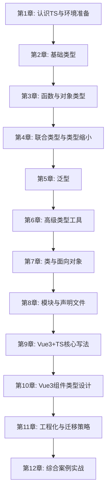

# TypeScript 学习文档（Vue3 实战版）

> 目标：从 0 到 1 建立 TypeScript（TS）完整知识体系，并落到 Vue3 真实开发场景。

---

## 0. 项目现状与学习定位

基于当前仓库信息（`vuedemo`）：
- 技术栈：`Vue 3 + Vite`
- 依赖：`vue@^3.5.25`、`vite@^7.3.1`
- 当前代码主要是 `JavaScript`（`src/main.js`、`<script setup>` 未启用 `lang="ts"`）
- 已有章节化 Vue 教学组件（`Chapter01~05`）

**定位**：本教程将以“在现有 Vue3 教学项目中引入 TS”为主线，让你从语法到工程化完整掌握。

---

## 学习总路线（章节计划）



---

## 第1章：认识 TypeScript 与环境准备

**学习目标**
- [ ] 理解 TS 和 JS 的关系
- [ ] 理解“编译期类型检查”价值
- [ ] 能在 Vue3 项目中启用 TS

### 1.1 TS 是什么（类比）

类比：
- `JavaScript` 像“直接上路开车”
- `TypeScript` 像“先通过驾照考试再上路”

TS 不改变 JS 运行时本质，核心是在**开发阶段提供类型检查**。

### 1.2 TS 工作流图

```text
你写 .ts/.vue 代码
      |
      v
TypeScript 编译器检查类型
      |
      +-- 有错误 -> 编译报错/IDE提示
      |
      v
输出 .js
      |
      v
浏览器/Node 运行
```

### 1.3 在 Vue3 中启用 TS（示例）

```bash
# 新建 TS 项目（推荐）
npm create vite@latest my-vue-ts -- --template vue-ts
```

将组件改为 TS：

```vue
<script setup lang="ts">
import { ref } from 'vue'

const count = ref<number>(0)
</script>
```

---

## 第2章：基础类型（最核心入门）

**学习目标**
- [ ] 掌握 `number/string/boolean`
- [ ] 理解 `array/tuple/enum`
- [ ] 区分 `any/unknown/never/void`

### 2.1 常见类型

```ts
let age: number = 18
let userName: string = 'Tom'
let isAdmin: boolean = false

let tags: string[] = ['vue', 'ts']
let scores: Array<number> = [95, 88]
```

### 2.2 元组与枚举

```ts
let httpResult: [number, string] = [200, 'ok']

enum Role {
  Visitor = 'visitor',
  Editor = 'editor',
  Admin = 'admin'
}

const role: Role = Role.Editor
```

### 2.3 `any` vs `unknown`（类比）

类比：
- `any`：保安直接放行，谁都能进（风险高）
- `unknown`：先验明身份，再放行（更安全）

```ts
let v1: any = 'abc'
v1.toFixed() // 编译不拦截，运行可能炸

let v2: unknown = 'abc'
if (typeof v2 === 'string') {
  console.log(v2.toUpperCase())
}
```

---

## 第3章：函数与对象类型

**学习目标**
- [ ] 掌握函数参数与返回值标注
- [ ] 掌握 `type` 与 `interface`
- [ ] 会写可选属性、只读属性

### 3.1 函数类型

```ts
function add(a: number, b: number): number {
  return a + b
}

const format = (name: string, age?: number): string => {
  return age ? `${name}(${age})` : name
}
```

### 3.2 对象类型设计

```ts
interface User {
  id: number
  name: string
  age?: number
  readonly createdAt: string
}

const u: User = {
  id: 1,
  name: 'Alice',
  createdAt: '2026-03-08'
}
```

### 3.3 `interface` 与 `type` 怎么选

```text
interface: 更像“合同模板”，适合对象结构、可扩展
 type    : 更像“类型表达式”，适合联合类型/工具类型
```

---

## 第4章：联合类型、类型缩小与守卫

**学习目标**
- [ ] 理解联合类型 `A | B`
- [ ] 会用 `typeof/in/instanceof`
- [ ] 理解判别联合（discriminated union）

### 4.1 联合类型

```ts
function printId(id: number | string) {
  if (typeof id === 'string') {
    console.log(id.toUpperCase())
  } else {
    console.log(id.toFixed(0))
  }
}
```

### 4.2 判别联合（关键）

```ts
type LoadingState = { status: 'loading' }
type SuccessState = { status: 'success'; data: string[] }
type ErrorState = { status: 'error'; message: string }

type FetchState = LoadingState | SuccessState | ErrorState

function render(state: FetchState) {
  switch (state.status) {
    case 'loading':
      return '加载中...'
    case 'success':
      return `共 ${state.data.length} 条`
    case 'error':
      return state.message
  }
}
```

### 4.3 图示：类型缩小

```text
id: string | number
   |
   +-- typeof id === 'string' --> id: string
   |
   +-- else                  --> id: number
```

---

## 第5章：泛型（从“写死类型”到“可复用类型”）

**学习目标**
- [ ] 理解泛型 `<T>` 本质
- [ ] 会写泛型函数、泛型接口
- [ ] 在 Vue Hook 中使用泛型

### 5.1 泛型类比

类比：
- 普通函数像“固定尺码衣服”
- 泛型函数像“可调尺码模板”

### 5.2 泛型函数

```ts
function identity<T>(value: T): T {
  return value
}

const n = identity<number>(123)
const s = identity('hello')
```

### 5.3 Vue3 中的泛型 Hook

```ts
import { ref } from 'vue'

function useList<T>() {
  const list = ref<T[]>([])
  const setList = (data: T[]) => {
    list.value = data
  }
  return { list, setList }
}

// 使用
interface Todo { id: number; title: string; done: boolean }
const { list: todoList, setList } = useList<Todo>()
```

---

## 第6章：高级类型工具（工程效率提升）

**学习目标**
- [ ] 掌握 `Partial/Required/Pick/Omit/Record`
- [ ] 理解 `keyof`、索引访问类型
- [ ] 初步理解映射类型

### 6.1 常用工具类型

```ts
interface Todo {
  id: number
  title: string
  done: boolean
  desc?: string
}

type TodoDraft = Partial<Todo>
type TodoStrict = Required<Todo>
type TodoPreview = Pick<Todo, 'id' | 'title'>
type TodoWithoutDesc = Omit<Todo, 'desc'>
type TodoMap = Record<number, Todo>
```

### 6.2 `keyof` 与索引访问

```ts
type TodoKey = keyof Todo          // 'id' | 'title' | 'done' | 'desc'
type TodoTitleType = Todo['title'] // string
```

### 6.3 图示：映射类型

```text
原类型: { name: string; age: number }
          |
          v
Partial<T>
          |
          v
结果: { name?: string; age?: number }
```

---

## 第7章：类与面向对象（理解即可，Vue 中按需使用）

**学习目标**
- [ ] 掌握类、继承、访问修饰符
- [ ] 理解 `implements`
- [ ] 知道在前端何时使用类

```ts
interface Logger {
  log(msg: string): void
}

class ConsoleLogger implements Logger {
  constructor(private prefix: string) {}

  log(msg: string): void {
    console.log(`[${this.prefix}] ${msg}`)
  }
}

const logger = new ConsoleLogger('Todo')
logger.log('created')
```

**建议**：Vue3 业务代码通常以函数式（Composition API）为主，类更多见于 SDK、模型层、复杂封装。

---

## 第8章：模块系统与声明文件

**学习目标**
- [ ] 理解 `import/export` 类型导入
- [ ] 会区分值导入与类型导入
- [ ] 能处理第三方库无类型问题

### 8.1 类型导入

```ts
import type { User } from './types'
import { fetchUser } from './api'
```

### 8.2 声明文件示例

当某 JS 库没有类型时，可写 `xxx.d.ts`：

```ts
declare module 'legacy-lib' {
  export function parse(input: string): { ok: boolean }
}
```

---

## 第9章：Vue3 + TypeScript 核心写法

**学习目标**
- [ ] 熟练 `ref/reactive/computed/watch` 的 TS 写法
- [ ] 会给事件、DOM、异步请求加类型
- [ ] 形成组件内“类型优先”习惯

### 9.1 响应式类型

```vue
<script setup lang="ts">
import { ref, reactive, computed } from 'vue'

interface FormState {
  userName: string
  age: number
}

const count = ref<number>(0)
const form = reactive<FormState>({
  userName: '',
  age: 18
})

const label = computed<string>(() => `${form.userName}-${count.value}`)
</script>
```

### 9.2 事件类型

```ts
function handleInput(e: Event) {
  const target = e.target as HTMLInputElement
  console.log(target.value)
}
```

### 9.3 异步请求类型

```ts
interface ApiResponse<T> {
  code: number
  data: T
  message: string
}

interface TodoItem {
  id: number
  title: string
  done: boolean
}

async function fetchTodos(): Promise<ApiResponse<TodoItem[]>> {
  const res = await fetch('/api/todos')
  return res.json()
}
```

---

## 第10章：Vue3 组件类型设计（高频实战）

**学习目标**
- [ ] 掌握 `Props/Emits/Slots` 类型约束
- [ ] 会写 `defineExpose` 与模板 ref 类型
- [ ] 会设计可复用组件 API

### 10.1 Props + Emits

```vue
<script setup lang="ts">
interface Props {
  modelValue: string
  maxLength?: number
}

const props = withDefaults(defineProps<Props>(), {
  maxLength: 50
})

const emit = defineEmits<{
  (e: 'update:modelValue', value: string): void
  (e: 'submit'): void
}>()

function onInput(e: Event) {
  const value = (e.target as HTMLInputElement).value
  if (value.length <= props.maxLength) {
    emit('update:modelValue', value)
  }
}
</script>
```

### 10.2 模板 Ref

```vue
<script setup lang="ts">
import { ref, onMounted } from 'vue'

const inputRef = ref<HTMLInputElement | null>(null)

onMounted(() => {
  inputRef.value?.focus()
})
</script>
```

### 10.3 图示：组件类型流

```text
父组件传 Props(入参约束)
          |
          v
子组件内部处理
          |
          v
Emit 事件(出参约束) -> 父组件接收
```

---

## 第11章：工程化配置与 JS -> TS 迁移策略

**学习目标**
- [ ] 理解 `tsconfig` 关键配置
- [ ] 掌握渐进式迁移流程
- [ ] 建立“先类型后功能”的开发习惯

### 11.1 tsconfig 关键项（建议）

```json
{
  "compilerOptions": {
    "target": "ES2020",
    "module": "ESNext",
    "strict": true,
    "noImplicitAny": true,
    "moduleResolution": "Bundler",
    "skipLibCheck": true,
    "jsx": "preserve",
    "types": ["vite/client"]
  }
}
```

### 11.2 渐进式迁移路线

1. 新文件优先使用 `.ts` / `<script setup lang="ts">`
2. 先改“数据模型层”（`types.ts`、`api.ts`）
3. 再改“公共组件层”（Props/Emits）
4. 最后改“页面与业务流”
5. 全程开启 `strict`，尽量不使用 `any`

### 11.3 迁移心法（类比）

类比：旧城改造。
- 不推倒重来（风险高）
- 分街区施工（模块化迁移）
- 先修主干道（核心类型）

---

## 第12章：综合案例教学（重点）

> 本章给出 3 个综合案例，覆盖“类型建模、组件设计、业务状态、可复用 Hook”。

---

### 案例1：Todo 模块（类型建模 + 列表组件）

**学习目标**
- [ ] 能设计领域类型
- [ ] 能让组件 Props/Emits 强类型

#### 1) 领域类型

```ts
export interface Todo {
  id: number
  title: string
  done: boolean
  priority: 'low' | 'medium' | 'high'
  createdAt: string
}

export type CreateTodoDTO = Pick<Todo, 'title' | 'priority'>
export type UpdateTodoDTO = Partial<Omit<Todo, 'id' | 'createdAt'>>
```

#### 2) 组件契约（TodoItem.vue）

```vue
<script setup lang="ts">
import type { Todo } from './types'

const props = defineProps<{ item: Todo }>()
const emit = defineEmits<{
  (e: 'toggle', id: number): void
  (e: 'remove', id: number): void
}>()
</script>
```

#### 3) 训练点

- 联合字面量：限制 `priority`
- `Pick/Partial/Omit`：复用类型，避免重复定义
- 事件参数类型：避免“传错 id”

---

### 案例2：通用 `useRequest` Hook（泛型 + 异步状态机）

**学习目标**
- [ ] 掌握泛型在异步请求中的实际用法
- [ ] 掌握判别联合表达状态

```ts
import { ref } from 'vue'

type RequestState<T> =
  | { status: 'idle' }
  | { status: 'loading' }
  | { status: 'success'; data: T }
  | { status: 'error'; message: string }

export function useRequest<T>(requestFn: () => Promise<T>) {
  const state = ref<RequestState<T>>({ status: 'idle' })

  async function run() {
    state.value = { status: 'loading' }
    try {
      const data = await requestFn()
      state.value = { status: 'success', data }
    } catch (e) {
      const msg = e instanceof Error ? e.message : 'unknown error'
      state.value = { status: 'error', message: msg }
    }
  }

  return { state, run }
}
```

在组件中：

```ts
const { state, run } = useRequest<Todo[]>(fetchTodos)
```

---

### 案例3：可复用表格组件 `DataTable<T>`（泛型组件思想）

**学习目标**
- [ ] 理解“同一组件支持不同数据模型”
- [ ] 掌握 `keyof` 驱动列配置

```ts
export interface Column<T> {
  key: keyof T
  title: string
  width?: number
}

interface User {
  id: number
  name: string
  age: number
}

const columns: Column<User>[] = [
  { key: 'id', title: 'ID' },
  { key: 'name', title: '姓名' },
  { key: 'age', title: '年龄' }
]
```

**价值**：列名受类型约束，写错 `key` 会直接报错。

---

## 学习资料推荐（官网 / 博客 / 视频）

> 更新时间说明：以下资源已按 **2026-03-08** 做过筛选。  
> TypeScript 官方动态显示：`5.9` 已发布，`6.0` 处于 `RC/Beta` 阶段。

### A. 官网与权威文档（优先级最高）

1. TypeScript 官方文档（中文入口）：<https://www.typescriptlang.org/zh/docs/>
2. TypeScript Handbook（系统主线）：<https://www.typescriptlang.org/docs/handbook/intro.html>
3. TypeScript Playground（在线试验场）：<https://www.typescriptlang.org/play/>
4. Vue 官方：Using Vue with TypeScript：<https://vuejs.org/guide/typescript/overview.html>
5. Vue 官方：TypeScript with Composition API：<https://vuejs.org/guide/typescript/composition-api.html>
6. Pinia 官方核心概念（含 TS 友好写法）：<https://pinia.vuejs.org/core-concepts/>
7. Vite 官方 TS 特性说明：<https://vite.dev/guide/features.html#typescript>
8. TypeScript 团队官方博客（版本发布/变更解读）：<https://devblogs.microsoft.com/typescript/>

**建议用法**：  
先按本教程章节学，再把对应章节映射到 Handbook（如泛型、条件类型、映射类型）做二次巩固。

### B. 优秀博客与专栏（进阶理解）

1. The Vue Point（Vue 官方博客）：<https://blog.vuejs.org/>
2. 2ality（Axel，TS/JS 深度文章）：<https://2ality.com/>
3. Marius Schulz（TS 经典文章库）：<https://mariusschulz.com/>
4. TypeScript Evolution 系列（按版本学习 TS 特性）：<https://mariusschulz.com/blog/series/typescript-evolution>
5. Anthony Fu Blog（Vue/Vite/类型系统实践）：<https://antfu.me/posts>
6. Exploring TypeScript（系统化书籍，支持在线阅读）：<https://exploringjs.com/ts/>
7. TypeScript Deep Dive（免费在线书）：<https://basarat.gitbook.io/typescript/>

**阅读顺序建议**：  
官方文档打基础 -> Marius/2ality 做深挖 -> Anthony Fu 结合 Vue 工程实践。

### C. 视频资源（按“免费优先 + 体系化”）

1. freeCodeCamp - Learn TypeScript Full Tutorial（YouTube，免费）：<https://www.youtube.com/watch?v=30LWjhZzg50>
2. Frontend Masters - TypeScript and Vue 3（Ben Hong，体系化）：<https://frontendmasters.com/courses/vue-typescript/>
3. Vue School（含 Vue + TS 课程与实战路径）：<https://vueschool.io/>
4. Vue Mastery（Vue 体系课程）：<https://www.vuemastery.com/>
5. B 站：尚硅谷 Vue3 + TypeScript 项目实战（长线实战）：<https://www.bilibili.com/video/BV1Xh411V7b5/>
6. 尚硅谷官网：Vue3.0（全程 TS + 组合式 API 说明）：<https://www.atguigu.com/video/284/>

**观看策略**：  
每看完一个小节，立刻在本仓库写 10~30 行对应 TS/Vue 示例，不只“看懂”，要“写会”。

### D. 练习与刷题资源（把类型能力练出来）

1. Type Challenges（类型体操，进阶必做）：<https://github.com/type-challenges/type-challenges>
2. Total TypeScript Free Tutorials（大量练习题与讲解）：<https://www.totaltypescript.com/tutorials>
3. Vue SFC Playground（快速验证 Vue + TS 片段）：<https://play.vuejs.org/>

**练习建议**：  
每周至少做 3~5 题 Type Challenges；遇到不会的，先写“错误版本”，再逐步缩小类型范围。

---

## 阶段练习建议（按章节推进）

1. 第1-4章后：把现有 `src/main.js` 与 1 个组件改成 TS。
2. 第5-8章后：实现 `usePagination<T>()`、`useRequest<T>()` 两个泛型 Hook。
3. 第9-11章后：将一个完整页面迁移为 TS（含 Props/Emits/API 类型）。
4. 第12章后：独立完成“Todo + 筛选 + 统计 + 本地持久化”TS 版本。

---

## 常见错误清单

- 用 `any` 快速绕过报错，后续难维护
- `ref` 忘记 `.value`（脚本中）
- `reactive` 对象直接解构导致丢失响应式
- `as` 滥用（断言不是“修复”，只是告诉编译器“相信我”）
- API 返回不建模，导致数据流类型混乱

---

## 学完后的能力标准（验收）

你应当可以做到：
- 独立为 Vue3 项目设计 `types` 层
- 为组件写出规范的 `Props/Emits` 类型
- 用泛型封装通用 Hook
- 用工具类型减少重复代码
- 进行中大型 JS 项目的渐进 TS 迁移

---

## 附：推荐实操目录结构（可直接在本仓库扩展）

```text
ts/
├── typescript学习文档.md
├── demo-types/
│   ├── todo.ts
│   ├── api.ts
│   └── common.ts
└── vue3-ts-examples/
    ├── useRequest.ts
    ├── usePagination.ts
    └── DataTable.types.ts
```

> 建议学习方式：每学完一章，就在 `ts/vue3-ts-examples/` 写一个最小示例并跑通。
