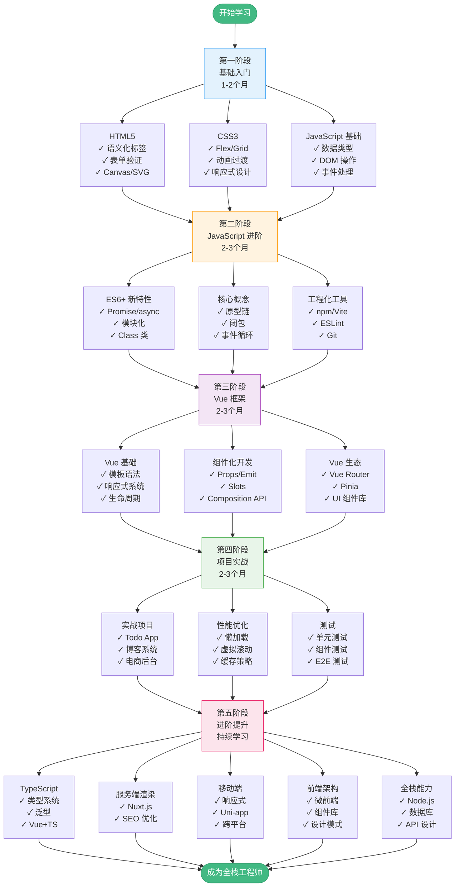

# 前端学习路线

> 从零基础到 Vue 全栈开发的完整学习路径

---

## 📊 学习路线图谱



---

## 📋 学习进度追踪表

### 阶段一：基础入门（预计 1-2 个月）

| 知识点 | 学习资料 | 预计时间 | 完成状态 | 完成日期 |
|--------|---------|---------|---------|---------|
| HTML5 基础 | [01_html5.md](./01_html5.md) | 3 天 | ☐ | ___ / ___ |
| CSS3 样式 | [02_css3.md](./02_css3.md) | 5 天 | ☐ | ___ / ___ |
| JavaScript 基础 | [03_javascript.md](./03_javascript.md) | 7 天 | ☐ | ___ / ___ |
| 工具链配置 | [04_toolchain.md](./04_toolchain.md) | 2 天 | ☐ | ___ / ___ |

**阶段目标**：能够独立编写静态网页，掌握基本的 DOM 操作

---

### 阶段二：JavaScript 进阶（预计 2-3 个月）

| 知识点 | 学习资料 | 预计时间 | 完成状态 | 完成日期 |
|--------|---------|---------|---------|---------|
| ES6+ 新特性 | MDN / 现代 JavaScript 教程 | 1 周 | ☐ | ___ / ___ |
| 原型与闭包 | 《你不知道的 JavaScript》 | 1 周 | ☐ | ___ / ___ |
| 异步编程 | Promise/async/await 实践 | 1 周 | ☐ | ___ / ___ |
| 模块化开发 | ES Modules / CommonJS | 3 天 | ☐ | ___ / ___ |
| 工程化实践 | Vite + ESLint + Git | 3 天 | ☐ | ___ / ___ |

**阶段目标**：深入理解 JavaScript 核心机制，能够编写模块化代码

---

### 阶段三：Vue 框架（预计 2-3 个月）

| 知识点 | 学习资料 | 预计时间 | 完成状态 | 完成日期 |
|--------|---------|---------|---------|---------|
| Vue 模板语法 | [05_vue_basics.md](./05_vue_basics.md) | 3 天 | ☐ | ___ / ___ |
| 响应式系统 | [06_vue_reactivity.md](./06_vue_reactivity.md) | 4 天 | ☐ | ___ / ___ |
| 组件化开发 | [07_vue_components.md](./07_vue_components.md) | 5 天 | ☐ | ___ / ___ |
| Vue Router | [08_vue_router.md](./08_vue_router.md) | 3 天 | ☐ | ___ / ___ |
| Pinia 状态管理 | [09_vue_pinia.md](./09_vue_pinia.md) | 3 天 | ☐ | ___ / ___ |
| UI 组件库 | Element Plus 官方文档 | 3 天 | ☐ | ___ / ___ |

**阶段目标**：熟练使用 Vue 3 全家桶，能够开发中小型单页应用

---

### 阶段四：项目实战（预计 2-3 个月）

| 项目 | 技术栈 | 预计时间 | 完成状态 | 完成日期 |
|------|--------|---------|---------|---------|
| Todo App | [10_project.md](./10_project.md) | 3 天 | ☐ | ___ / ___ |
| 个人博客 | Vue 3 + Markdown | 1 周 | ☐ | ___ / ___ |
| 电商后台 | Vue 3 + Element Plus | 2 周 | ☐ | ___ / ___ |
| 社交应用 | Vue 3 + WebSocket | 2 周 | ☐ | ___ / ___ |

**阶段目标**：完成 2-3 个完整项目，建立个人作品集

---

### 阶段五：进阶提升（持续学习）

| 方向 | 学习内容 | 优先级 | 完成状态 | 备注 |
|------|---------|--------|---------|------|
| TypeScript | 类型系统 + Vue TS 实践 | ⭐⭐⭐ | ☐ | 提升代码质量 |
| 性能优化 | 懒加载、虚拟滚动、缓存 | ⭐⭐⭐ | ☐ | 必备技能 |
| 测试 | Vitest + Vue Test Utils | ⭐⭐ | ☐ | 保证代码质量 |
| SSR | Nuxt.js 框架 | ⭐⭐ | ☐ | SEO 优化 |
| 移动端 | Uni-app / Taro | ⭐ | ☐ | 跨平台开发 |
| Node.js | Express + MongoDB | ⭐⭐ | ☐ | 全栈能力 |
| 微前端 | qiankun / Module Federation | ⭐ | ☐ | 大型项目 |

**阶段目标**：根据职业规划选择 2-3 个方向深入学习

---

## 🎯 学习里程碑

### 🏆 初级前端工程师（3-4 个月）

- ✅ 掌握 HTML/CSS/JavaScript 基础
- ✅ 能够使用 Vue 3 开发简单应用
- ✅ 完成 1-2 个个人项目
- ✅ 熟悉 Git 版本控制

**求职方向**：前端实习生、初级前端开发

---

### 🏆 中级前端工程师（6-12 个月）

- ✅ 深入理解 Vue 3 响应式原理
- ✅ 熟练使用 Vue Router + Pinia
- ✅ 完成 3-5 个完整项目
- ✅ 掌握性能优化基本技巧
- ✅ 了解前端工程化最佳实践

**求职方向**：前端开发工程师

---

### 🏆 高级前端工程师（1-2 年）

- ✅ 精通 Vue 3 生态系统
- ✅ 掌握 TypeScript
- ✅ 有大型项目经验
- ✅ 能够进行架构设计
- ✅ 具备性能优化和问题排查能力

**求职方向**：高级前端工程师、技术负责人

---

### 🏆 全栈工程师（2+ 年）

- ✅ 前端技术栈精通
- ✅ 掌握 Node.js 后端开发
- ✅ 熟悉数据库设计
- ✅ 能够独立完成全栈项目
- ✅ 具备系统架构能力

**求职方向**：全栈工程师、技术专家

---

## 📚 配套学习资料

### 本教程文件清单

| 文件 | 内容 | 难度 |
|------|------|------|
| [INDEX.md](./INDEX.md) | 学习导航总览 | - |
| [01_html5.md](./01_html5.md) | HTML5 基础 | ⭐ |
| [02_css3.md](./02_css3.md) | CSS3 样式 | ⭐⭐ |
| [03_javascript.md](./03_javascript.md) | JavaScript 核心 | ⭐⭐⭐ |
| [04_toolchain.md](./04_toolchain.md) | 工具链配置 | ⭐⭐ |
| [05_vue_basics.md](./05_vue_basics.md) | Vue 模板语法 | ⭐⭐ |
| [06_vue_reactivity.md](./06_vue_reactivity.md) | Vue 响应式 | ⭐⭐⭐ |
| [07_vue_components.md](./07_vue_components.md) | Vue 组件化 | ⭐⭐⭐ |
| [08_vue_router.md](./08_vue_router.md) | Vue Router | ⭐⭐ |
| [09_vue_pinia.md](./09_vue_pinia.md) | Pinia 状态管理 | ⭐⭐⭐ |
| [10_project.md](./10_project.md) | Todo App 实战 | ⭐⭐⭐ |

---

## 💡 学习建议

### 1. 循序渐进，打好基础

```
❌ 错误做法：直接学 Vue，跳过 JavaScript 基础
✅ 正确做法：扎实掌握 HTML/CSS/JS，再学框架
```

**为什么？**
- 框架只是工具，JavaScript 才是核心
- 基础不牢，遇到问题无法排查
- 面试会考察 JavaScript 原理

---

### 2. 理论结合实践

```
学习流程：
1. 看文档/教程（20%）
2. 写代码验证（60%）
3. 总结笔记（20%）
```

**每学一个知识点都要：**
- ✅ 自己敲一遍代码
- ✅ 修改参数看效果
- ✅ 尝试解决报错
- ✅ 记录关键点

---

### 3. 做项目巩固知识

| 学习阶段 | 推荐项目 | 核心技能 |
|---------|---------|---------|
| 基础阶段 | 计算器、贪吃蛇 | DOM 操作、事件处理 |
| Vue 入门 | Todo List、天气应用 | 组件、数据绑定 |
| Vue 进阶 | 博客系统、电商后台 | 路由、状态管理 |
| 实战阶段 | 社交应用、协作工具 | 完整项目流程 |

---

### 4. 阅读优秀源码

**推荐阅读顺序：**

1. **Vue 3 官方示例**（入门）
   - https://github.com/vuejs/vue-next/tree/master/packages/vue/examples

2. **Element Plus 组件**（进阶）
   - 学习组件设计思路
   - 理解 TypeScript 应用

3. **Vite 源码**（高级）
   - 理解构建工具原理
   - 学习插件机制

---

### 5. 持续学习，保持热情

**每周学习计划：**

```
周一至周五：
  - 晚上 2 小时学习新知识
  - 周末 4-6 小时做项目

学习方式：
  - 看视频教程（快速入门）
  - 读官方文档（深入理解）
  - 写技术博客（巩固知识）
  - 参与开源项目（实战经验）
```

---

## 📖 推荐学习资源

### 官方文档（最权威）

| 技术 | 文档地址 | 说明 |
|------|---------|------|
| HTML/CSS/JS | https://developer.mozilla.org/zh-CN/ | MDN 最全面 |
| Vue 3 | https://cn.vuejs.org/ | 中文文档很详细 |
| Vue Router | https://router.vuejs.org/zh/ | 路由官方文档 |
| Pinia | https://pinia.vuejs.org/zh/ | 状态管理 |
| Vite | https://cn.vitejs.dev/ | 构建工具 |
| TypeScript | https://www.typescriptlang.org/zh/ | 类型系统 |

---

### 在线练习平台

| 平台 | 地址 | 适合阶段 |
|------|------|---------|
| Vue Playground | https://play.vuejs.org/ | Vue 在线练习 |
| StackBlitz | https://stackblitz.com/ | 在线 IDE |
| CodeSandbox | https://codesandbox.io/ | 项目沙盒 |
| Flexbox Froggy | https://flexboxfroggy.com/#zh-cn | CSS Flex 游戏 |
| Grid Garden | https://cssgridgarden.com/#zh-cn | CSS Grid 游戏 |
| Codewars | https://www.codewars.com/ | JS 算法练习 |
| LeetCode | https://leetcode.cn/ | 算法刷题 |

---

### 视频教程

| 教程 | 平台 | 特点 |
|------|------|------|
| 黑马程序员 Vue3 | B站 | 免费、系统、适合入门 |
| 尚硅谷 Vue3 | B站 | 免费、详细、有项目 |
| 技术胖 Vue3 | B站 | 通俗易懂、实战多 |
| Vue Mastery | 官网 | 英文、高质量、部分收费 |
| Frontend Masters | 官网 | 英文、专业、收费 |

---

### 书籍推荐

| 书名 | 作者 | 适合阶段 | 重点内容 |
|------|------|---------|---------|
| 《JavaScript 高级程序设计》第4版 | Matt Frisbie | 基础-进阶 | JS 圣经，必读 |
| 《你不知道的 JavaScript》上中卷 | Kyle Simpson | 进阶 | 深入理解 JS 核心 |
| 《JavaScript 权威指南》第7版 | David Flanagan | 进阶 | 全面、权威 |
| 《CSS 揭秘》 | Lea Verou | 基础-进阶 | CSS 技巧大全 |
| 《深入浅出 Vue.js》 | 刘博文 | Vue 进阶 | Vue 原理解析 |
| 《Vue.js 设计与实现》 | 霍春阳 | Vue 高级 | 响应式原理 |
| 《TypeScript 编程》 | Boris Cherny | TS 入门 | TS 系统学习 |

---

### 技术社区

| 社区 | 地址 | 特点 |
|------|------|------|
| 掘金 | https://juejin.cn/ | 中文、质量高、前端氛围好 |
| 思否 SegmentFault | https://segmentfault.com/ | 中文、问答社区 |
| V2EX | https://www.v2ex.com/ | 综合技术社区 |
| GitHub | https://github.com/ | 开源项目、学习源码 |
| Stack Overflow | https://stackoverflow.com/ | 英文、问答权威 |
| Vue 中文论坛 | https://forum.vuejs.org/ | Vue 官方论坛 |

---

### 优质博客/公众号

**个人博客：**
- 阮一峰的网络日志：https://www.ruanyifeng.com/blog/
- 张鑫旭的博客：https://www.zhangxinxu.com/
- 冴羽的博客：https://github.com/mqyqingfeng/Blog

**公众号推荐：**
- 前端早读课
- 前端之巅
- 前端大全
- Vue 中文社区

---

## 🎓 学习路径示例

### 示例 1：在校学生（充足时间）

```
时间规划：6-8 个月

第 1-2 个月：HTML/CSS/JavaScript 基础
  - 每天 3-4 小时
  - 完成 MDN 教程
  - 做 5-10 个小项目

第 3-4 个月：JavaScript 进阶 + 工程化
  - 每天 3-4 小时
  - 深入学习 ES6+
  - 掌握 Git/npm/Vite

第 5-6 个月：Vue 3 全家桶
  - 每天 4-5 小时
  - 系统学习 Vue 生态
  - 完成 2-3 个完整项目

第 7-8 个月：项目实战 + 求职准备
  - 完成 1-2 个大项目
  - 准备简历和作品集
  - 刷算法题
```

---

### 示例 2：在职转行（时间有限）

```
时间规划：10-12 个月

工作日：
  - 早上 1 小时（6:00-7:00）
  - 晚上 2 小时（20:00-22:00）

周末：
  - 每天 6-8 小时

学习节奏：
  - 前 3 个月：基础三件套
  - 中 4 个月：JavaScript 进阶 + Vue
  - 后 3 个月：项目实战 + 求职

关键点：
  - 保持每天学习，不要断
  - 周末集中做项目
  - 利用通勤时间看视频
```

---

### 示例 3：快速上手（已有编程基础）

```
时间规划：3-4 个月

前提：熟悉其他编程语言（Java/Python 等）

第 1 周：HTML/CSS 快速过一遍
第 2-3 周：JavaScript 核心概念
第 4-5 周：ES6+ 和工程化
第 6-8 周：Vue 3 全家桶
第 9-12 周：项目实战

学习重点：
  - 重点学 JavaScript 特性（原型、闭包、异步）
  - Vue 官方文档精读
  - 快速上手做项目
```

---

## 🚀 职业发展路径

### 路径 1：专精前端

```
初级前端 → 中级前端 → 高级前端 → 前端架构师

技能树：
  ├─ 基础：HTML/CSS/JS
  ├─ 框架：Vue/React 精通
  ├─ 工程化：构建、部署、CI/CD
  ├─ 性能优化：首屏、加载、渲染
  ├─ 架构设计：微前端、组件库
  └─ 团队管理：Code Review、技术分享
```

---

### 路径 2：全栈发展

```
前端工程师 → 全栈工程师 → 技术专家

技能树：
  ├─ 前端：Vue 生态精通
  ├─ 后端：Node.js + Express/Koa
  ├─ 数据库：MongoDB/MySQL/Redis
  ├─ 运维：Docker/Nginx/Linux
  ├─ 架构：微服务、分布式
  └─ 产品：需求分析、项目管理
```

---

### 路径 3：跨界发展

```
前端工程师 → 产品经理 / UI 设计师 / 技术管理

优势：
  - 懂技术，能评估开发成本
  - 理解用户交互和体验
  - 沟通效率高
```

---

## 📝 学习检查清单

### 阶段一：基础入门

- [ ] 能够手写 HTML 页面结构
- [ ] 熟练使用 Flexbox 和 Grid 布局
- [ ] 理解 CSS 盒模型和定位
- [ ] 掌握 JavaScript 基本语法
- [ ] 能够操作 DOM 和处理事件
- [ ] 完成至少 3 个静态页面项目

---

### 阶段二：JavaScript 进阶

- [ ] 理解原型链和继承
- [ ] 掌握闭包和作用域
- [ ] 熟练使用 Promise 和 async/await
- [ ] 理解事件循环机制
- [ ] 会使用 ES6+ 新特性
- [ ] 熟悉 npm 和模块化开发
- [ ] 能够使用 Git 进行版本控制

---

### 阶段三：Vue 框架

- [ ] 理解 Vue 响应式原理
- [ ] 熟练使用 Composition API
- [ ] 掌握组件通信的各种方式
- [ ] 会使用 Vue Router 管理路由
- [ ] 会使用 Pinia 管理状态
- [ ] 能够使用 UI 组件库
- [ ] 完成至少 2 个 Vue 项目

---

### 阶段四：项目实战

- [ ] 独立完成 1 个完整项目
- [ ] 理解前后端分离开发
- [ ] 会调用 RESTful API
- [ ] 掌握基本的性能优化
- [ ] 了解前端安全（XSS/CSRF）
- [ ] 会使用 Chrome DevTools 调试
- [ ] 能够部署项目上线

---

### 阶段五：进阶提升

- [ ] 掌握 TypeScript 基础
- [ ] 理解 SSR 原理
- [ ] 会编写单元测试
- [ ] 了解微前端架构
- [ ] 有大型项目经验
- [ ] 能够进行技术选型
- [ ] 具备代码审查能力

---

## 🎯 常见问题 FAQ

### Q1：零基础需要多久能找到工作？

**答**：
- 全职学习：6-8 个月
- 业余学习：10-12 个月

关键因素：
- 学习效率和方法
- 项目经验积累
- 所在城市就业环境

---

### Q2：需要学习 React 吗？

**答**：
- 先精通一个框架（Vue）
- 有余力再学 React
- 两者思想相通，学会一个，另一个很快

---

### Q3：要不要学 TypeScript？

**答**：
- 初学阶段：不急，先学好 JavaScript
- 找工作前：建议学习，很多公司要求
- 大型项目：必须掌握

---

### Q4：前端需要学算法吗？

**答**：
- 基础算法：必须掌握（数组、字符串、排序）
- 中等难度：面试常考（链表、树、动态规划）
- 高级算法：看公司要求

推荐：LeetCode 刷 100-200 题

---

### Q5：如何准备面试？

**答**：

**技术准备：**
- JavaScript 核心原理
- Vue 响应式原理
- 浏览器工作原理
- 网络协议（HTTP/HTTPS）
- 性能优化方案

**项目准备：**
- 准备 2-3 个项目详细介绍
- 能说清技术选型和难点
- 准备项目演示

**简历准备：**
- 突出项目经验
- 量化工作成果
- 附上 GitHub 链接

---

## 🎉 结语

前端学习是一个持续的过程，不要急于求成。按照这个路线图，一步一个脚印，相信你一定能成为优秀的前端工程师！

**记住：**
- 💪 坚持每天学习
- 🚀 多做项目实践
- 📚 保持学习热情
- 🤝 积极参与社区

**祝你学习顺利，早日找到理想的工作！**

---

> 📌 **快速开始**：从 [INDEX.md](./INDEX.md) 开始你的学习之旅 →

